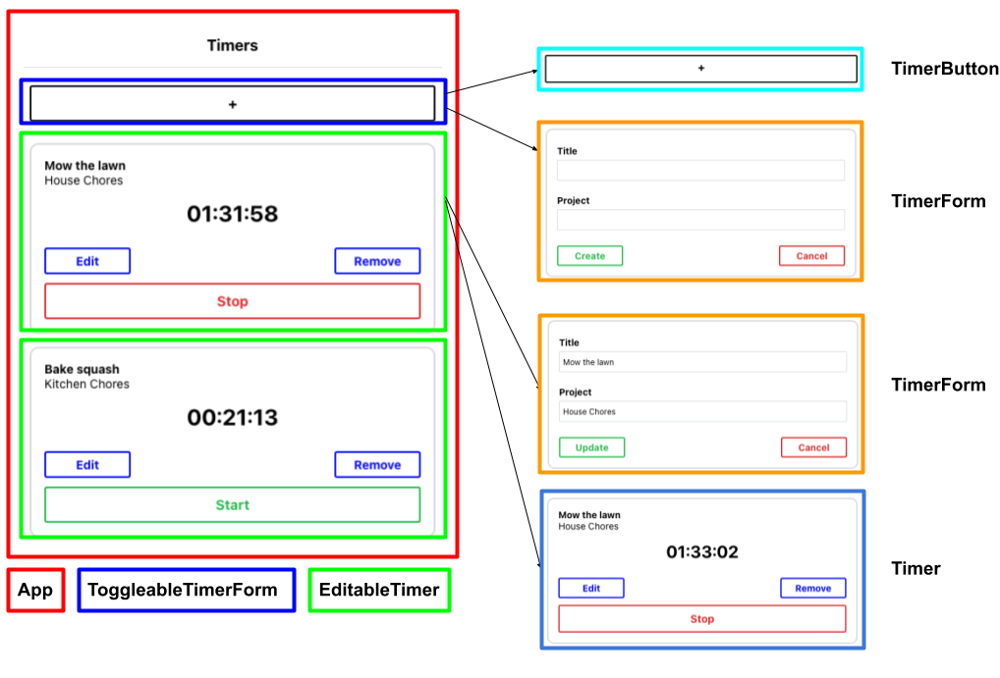
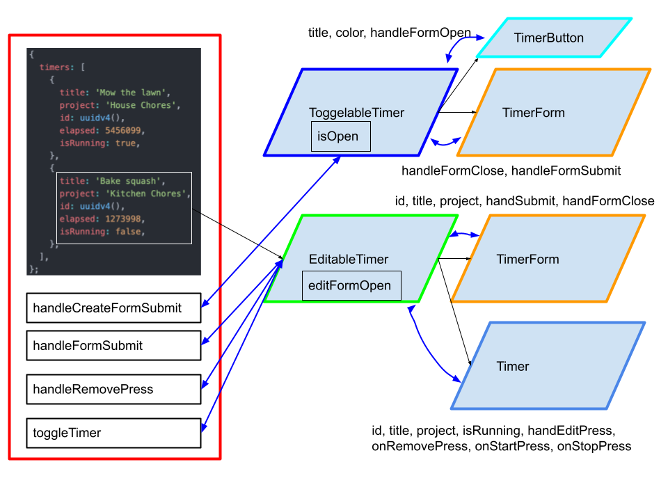

# Time Tracking App

The app is made up of several components as illustrated in this diagram: 

Give the data consumed by each component we need to decide what data should be stateful. Here is a list of criteria given in the [Thinking in React article](https://reactjs.org/docs/thinking-in-react.html):
1. Is it passed in from a parent via props? If so, it probably isn’t state.

  A lot of the data used in our child components are already listed in their parents. This criterion helps us de-duplicate.

  For example, “timer properties” is listed multiple times. When we see the properties declared in `EditableTimer`, we can consider it state. But when we see it elsewhere, it’s not.

2. Does it change over time? If not, it probably isn’t state.

  This is a key criterion of stateful data: it changes.

3. Can you compute it based on any other state or props in your component? If so, it’s not state.

  For simplicity, we want to strive to represent state with as few data points as possible.

Next, we need to decide where each piece of state should live. Here is a process given in the [Thinking in React article](https://reactjs.org/docs/thinking-in-react.html):

* Identify every component that renders something based on that state.
* Find a common owner component (a single component above all the
components that need the state in the hierarchy).
* Either the common owner or another component higher up in the hierarchy should own the state.
* If you can’t find a component where it makes sense to own the state,
create a new component simply for holding the state and add it somewhere in the hierarchy above the common owner component.
